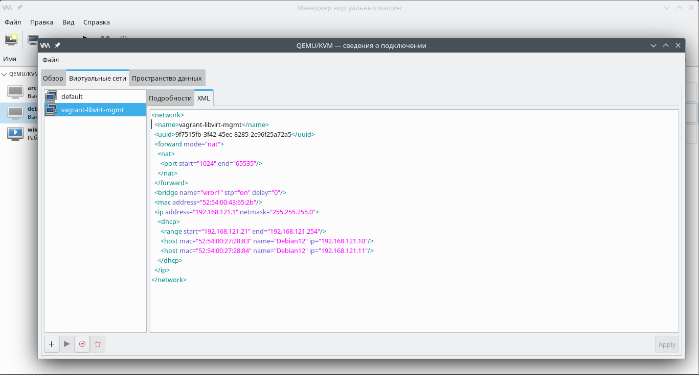

### Network File System
Network File System (NFS) - это протокол распределенной файловой системы, первоначально разработанный компанией Sun Microsystems в 1984 году, позволяющий пользователю клиентского компьютера получать доступ к файлам по сети аналогично тому, как осуществляется доступ к локальному хранилищу.
#### Подготовка окружения
В нашем примере используется гипервизор Qemu-KVM, библиотека Libvirt. В качестве хостовой системы - OpenSuse Leap 15.5. Автоматическое разворачивание стенда осуществляется с помощью Vagrant.

Для работы Vagrant с Libvirt установлен пакет vagrant-libvirt:
```
Сведения — пакет vagrant-libvirt:
---------------------------------
Репозиторий            : Основной репозиторий
Имя                    : vagrant-libvirt
Версия                 : 0.10.2-bp155.1.19
Архитектура            : x86_64
Поставщик              : openSUSE
Размер после установки : 658,3 KiB
Установлено            : Да
Состояние              : актуален
Пакет с исходным кодом : vagrant-libvirt-0.10.2-bp155.1.19.src
Адрес источника        : https://github.com/vagrant-libvirt/vagrant-libvirt
Заключение             : Провайдер Vagrant для libvirt
Описание               : 

    This is a Vagrant plugin that adds a Libvirt provider to Vagrant, allowing
    Vagrant to control and provision machines via the Libvirt toolkit.
```
Пакет Vagrant также устанавливаем из репозиториев. Текущая версия для OpenSuse Leap 15.5:
```
max@localhost:~/vagrant/vg3> vagrant -v
Vagrant 2.2.18
```
Образ операционной системы создан заранее, для этого установлен [Debian Linux из официального образа netinst](https://www.debian.org/distrib/netinst)

#### Vagrantfile
Все основные параметры виртуальных машин задаются в блоке ***vm.provider***. Для сервера NFS настройки выглядят таким образом:
```
Vagrant.configure("2") do |config|
  config.vm.define "Debian12" do |srv|
    srv.vm.box = "/home/max/vagrant/images/debian12"
    srv.vm.provider "libvirt" do |lv|
      lv.memory = "2048"
      lv.cpus = "2"
      lv.title = "Debian12"
      lv.description = "Виртуальная машина на базе дистрибутива Debian Linux"
      lv.management_network_name = "vagrant-libvirt-mgmt"
      lv.management_network_address = "192.168.121.0/24"
      lv.management_network_keep = "true"
      lv.management_network_mac = "52:54:00:27:28:83"
      lv.storage :file, :size => '1G', :device => 'vdb', :allow_existing => false
    end
```
Здесь заданы: 
  - кол-во процессоров, 
  - размер оперативной памяти, 
  - настройки сетевого интерфейса, 
  - дополнительгые дисковые устройства. 

Для сетевого адаптера указан определенный MAC-адрес, на основании этого значения для виртуальной машины будет зарезервирован ip-адрес - ***192.168.121.10/32***.

Для NFS-клиента соответствующий блок настроек выглядит так:
```
  config.vm.define "Debian12c" do |clnt|
    clnt.vm.box = "/home/max/vagrant/images/debian12"
    clnt.vm.provider "libvirt" do |lv|
    lv.memory = "2048"
    lv.cpus = "2"
    lv.title = "Debian12c"
    lv.description = "Виртуальная машина на базе дистрибутива Debian Linux"
    lv.management_network_name = "vagrant-libvirt-mgmt"
    lv.management_network_address = "192.168.121.0/24"
    lv.management_network_keep = "true"
    lv.management_network_mac = "52:54:00:27:28:84"
    lv.storage :file, :size => '1G', :device => 'vdb', :allow_existing => false
  end
```
IP-адрес клиентской машины - ***192.168.121.11/32***. Также выдается со стороны гипервизора с помощью настроек резервирования адресов.

Пример резервирования ip-адресов:



##### Пост установочная настройка - Provisioning
Блок настроек серверной части стенда выглядит так:
```
    srv.vm.provision "shell", inline: <<-SHELL
      brd='*************************************************************'
      echo "$brd"
      echo 'Если ранее не были установлены, то установим необходимые  пакеты'
      echo "$brd"
      apt install -y nfs-common nfs-kernel-server
      echo "Создадим директорию для экспорта и зададим права"
      mkdir -p /srv/share/upload
      chown -R nobody:nogroup /srv/share
      chmod 0777 /srv/share/upload
      echo '/srv/share 192.168.121.11/32(rw,sync,root_squash)' >> /etc/exports
      exportfs -r
      touch /srv/share/upload/check_file
      SHELL
    end
```
Здесь мы установили пакеты ***nfs-common*** и ***nfs-kernel-server***, создали директорию для экспорта и открыли к ней доступ с адреса ***192.168.121.11/32*** с правами на запись 
и подменой владельца с ***root*** на ***nobody*** для создаваемых файлов (параметр root_squash).

Блок настроек клиентской части стенда выглядит так:
```
  clnt.vm.provision "shell", inline: <<-SHELL
    brd='*************************************************************'
    echo "$brd"
    echo 'Если ранее не были установлены, то установим необходимые  пакеты'
    echo "$brd"
    apt install -y nfs-common
    mkdir /mnt/nfs
    # echo "192.168.121.10:/srv/share/ /mnt/nfs nfs vers=3,noauto,x-systemd.automount 0 0" >> /etc/fstab
    # systemctl daemon-reload
    # systemctl restart remote-fs.target
    SHELL
  end
```
Здесь мы устанавливаем необходимый для работы пакет ***nfs-common***. Остальные настройки (автомонтирование сетевого каталога) закрыты комментарием, так как в данном случае мы будем делать это вручную.
#### Ограничение используемого протокола
Для ограничения версии протокола, на которой работает NFS-сервер, используются параметры ***vers3=y, vers4=y, vers4.x=y*** в блоке [nfsd]:
```
[nfsd]
# debug=0
# threads=8
# host=
# port=0
# grace-time=90
# lease-time=90
# udp=n
# tcp=y
vers3=n
# vers4=y
# vers4.0=y
# vers4.1=y
# vers4.2=y
# rdma=n
# rdma-port=20049
```
Чтобы проверить, поддержка каких версий протокола NFS включена в данный момент, необходимо выполнить:
```
root@debian12:~# cat /proc/fs/nfsd/versions
-3 +4 +4.1 +4.2
```
Как видно, в нашем примере мы отключили третью врсию NFS.

К данной работе прилагаю также запись консоли. Для того, чтобы воспроизвести выполненные действия,
необходимо скачать файлы [screenrecord-2024-07-16.script](screenrecord-2024-07-16.script) и [screenrecord-2024-07-16.time](screenrecord-2024-07-16.time),
после чего выполнить в каталоге с загруженными файлами команду:
```
scriptreplay ./screenrecord-2024-07-16.time ./screenrecord-2024-07-16.script
```
В частности, в записи продемонстрировано ограничение со стороны сервера версии используемого протокола.

P.S. в современных дистрибутивах по умолчанию, в ядре отключена поддержка UDP протокола для NFS:
```
root@debian12:~# grep -i "udp" /boot/config-6.1.0-2* | grep "DISABLE"
/boot/config-6.1.0-21-amd64:CONFIG_NFS_DISABLE_UDP_SUPPORT=y
/boot/config-6.1.0-22-amd64:CONFIG_NFS_DISABLE_UDP_SUPPORT=y
root@debian12:~# rpcinfo | grep nfs
    100003    4    tcp       0.0.0.0.8.1            nfs        superuser
    100003    4    tcp6      ::.8.1                 nfs        superuser
```
Соответственно, работать с NFS по протоколу UDP возможно только после сборки своего ядра с соответствующими настройками.

Спасибо за прочтение! :potted_plant:
